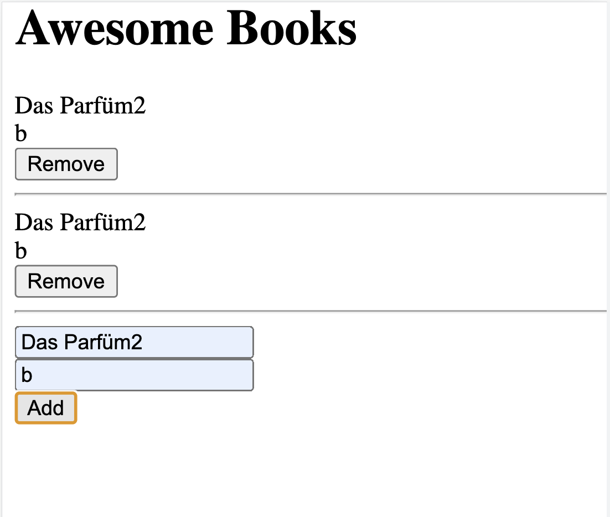

# Awesome_Books

<h1>Awesome Books</h1>

This is a book list where the user can store book titles.

So far, the website consists of a basic HTML structure and JavaScript functionality.

<h2>Built With</h2>

HTML 
JavaScript

<h2>Live Demo</h2>

<a href="#" rel="noopener noreferrer">Live Demo Link</a>

<h2>Getting Started</h2>

To get a local copy up and running follow these simple example steps.

<h3>Prerequisites</h3>

You need to have git set up on your local machine. If you are unfamiliar with the necessary steps, please find a step-by-step guide <a href="https://git-scm.com/book/en/v2/Getting-Started-First-Time-Git-Setup" rel="noopener noreferrer">here</a>

<h3>Setup</h3>

Once you have git set up on your computer, go to gitHub and open the dropdown menu by clicking on "code". Copy the project's HTTPS.

<h3>Install</h3>

In your terminal, navigate to where you want to set up the project folder, then enter git clone [project link], with the link being the one you just copied.

<h3>Usage</h3>

You can now edit the code or view it in your browser

<h3>Deployment</h3>

To open the project in your browser, find the project folder, right click on the html file and choose open in. Select the browser you would like to open the file with.

<h3>Authors</h3>

👤 Anja

GitHub: <a href="https://github.com/Anjacodes" rel="noopener noreferrer">@Anjacodes</a> 
Twitter: <a href="https://twitter.com/Anja_Schmidt7" rel="noopener noreferrer">@Anja_Schmidt7</a> 
LinkedIn: <a href="https://www.linkedin.com/in/anja-schmidt7/" rel="noopener noreferrer">Anja Schmidt</a> 

👤 Wajahat Akram

GitHub: wajahat414
Twitter: wajahat414
LinkedIn: wajahat414

<h2>🤝 Contributing</h2>

Contributions, issues, and feature requests are welcome!

Feel free to check the <a href="https://github.com/microverseinc/readme-template/issues" rel="noopener noreferrer">issues page</a>.

<h2>Show your support</h2>

Give a ⭐️ if you like this project!

<h2>Acknowledgments</h2>

Thank you Microverse for your guidance in making a great portfolio for myself!

<h2>📝 License</h2>

This project is <a href="https://github.com/microverseinc/readme-template/blob/master/MIT.md" rel="noopener noreferrer">MIT</a> licensed.
